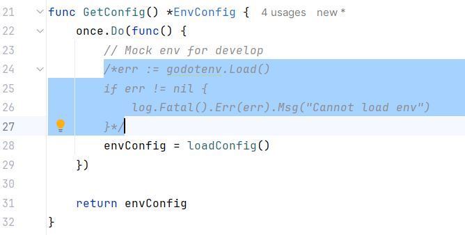

# My-gin-project

- ### Before build comment this line on [config.go](./app/config/config.go)



- ### Build image
```
docker build -t go-poc-app .
```
- ### Run Container
```
docker run --name go-app -p 8080:8080 -d --env-file .env go-poc-app
```